# Brian2 cppyy JIT Codegen Backend

## Overview

The cppyy backend replaces the Cython AOT (ahead-of-time) compilation pipeline with cppyy/Cling JIT (just-in-time) compilation. Instead of generating `.pyx` files, invoking an external C++ compiler, and loading `.so` shared libraries, the cppyy backend compiles C++ strings to machine code at runtime via LLVM — no external compiler required.

**Why this matters**: Cython compilation adds 30-60 seconds of startup overhead per simulation. The cppyy backend eliminates this entirely while running the same C++ code at the same speed.

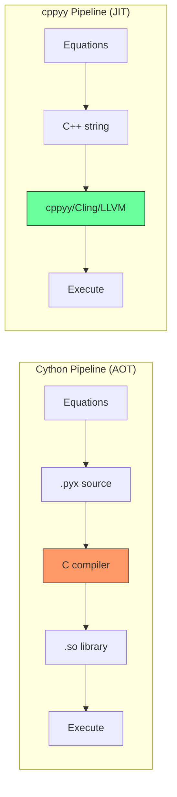

---

## End-to-End Flow: From Equations to Execution

This diagram shows the complete lifecycle from user-written equations to JIT-compiled machine code:

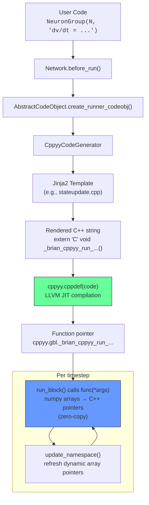

---

## Target Selection and Backend Priorities

When Brian2 starts, it registers available codegen targets:

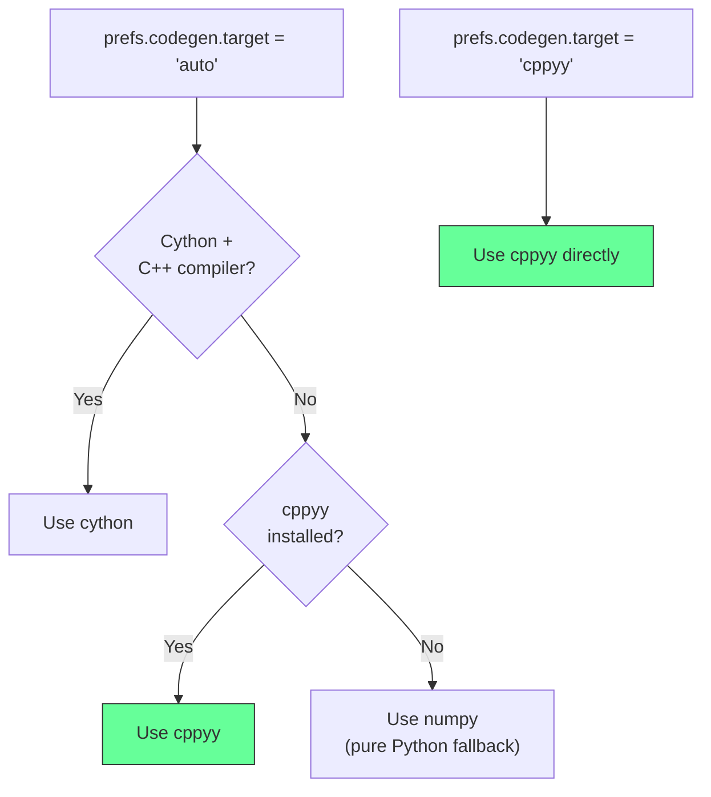

Each target registers via `codegen_targets.add(MyCodeObject)` in its `__init__.py`. The `auto_target()` function in `device.py` picks the best available.

---

## The Three Naming Worlds

The most critical invariant in the codebase. Three different naming conventions must stay synchronized across the Python/C++ boundary:

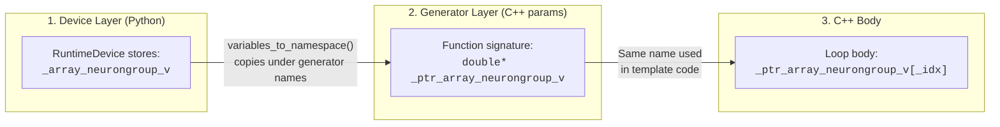

| Layer | Static Array | Dynamic Array (data) | Dynamic Array (container) |
|-------|-------------|----------------------|---------------------------|
| Device | `_array_G_v` | `_array_G_v` | `_dynamic_array_G_v` |
| Generator | `_ptr_array_G_v` | `_ptr_array_G_v` | `_dynamic_array_G_v` |
| C++ body | `_ptr_array_G_v[_idx]` | `_ptr_array_G_v[_idx]` | via `_dynamic_array_G_v_capsule` |

The generator's `get_array_name()` produces names for layers 2 and 3. The code object's `variables_to_namespace()` bridges layer 1 → 2.

---

## Parameter Synchronization: The Critical Invariant

The C++ function signature and the Python call-site arguments **must** have identical parameter order. This is maintained by two functions that mirror each other:

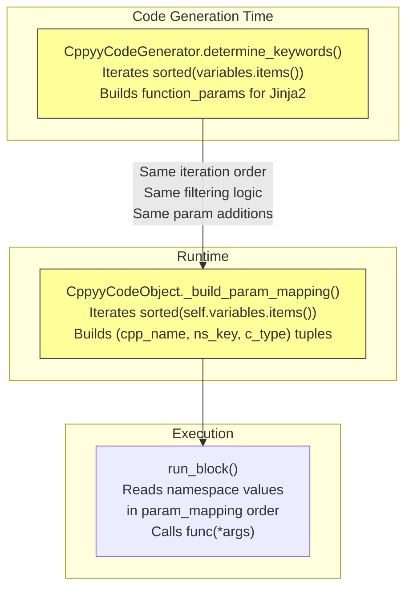

**Both functions MUST**:
1. Iterate `sorted(self.variables.items())`
2. Skip `AuxiliaryVariable`, `Subexpression`, `Function`
3. Handle `Constant` → scalar param
4. Handle `ArrayVariable` → pointer + `_num*` size + capsule (for dynamic)
5. Handle `*_capsule` object variables (e.g., `_queue_capsule`)

If these diverge, the C++ function receives wrong arguments → segfault or silent corruption.

---

## Template Architecture

All templates extend `common_group.cpp`, which defines the `extern "C"` function skeleton with three blocks:

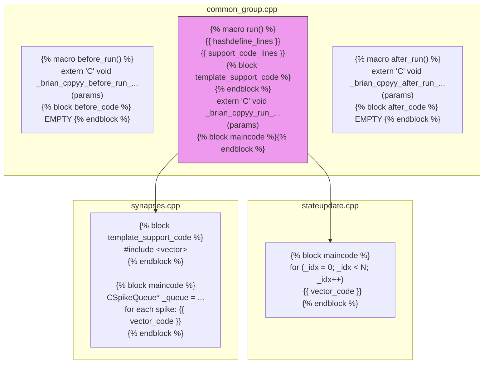

### Template Inventory

| Template | Purpose | Uses Capsules? | Special Features |
|----------|---------|----------------|------------------|
| `stateupdate.cpp` | ODE integration | No | Simple N-loop |
| `threshold.cpp` | Spike detection | No | Writes to spikespace |
| `reset.cpp` | Post-spike reset | No | Conditional on spikespace |
| `spikemonitor.cpp` | Record spike times | Yes (1D) | Resizes `t`, `i`, recorded vars |
| `statemonitor.cpp` | Record variable traces | Yes (2D) | Resizes 2D arrays per timestep |
| `ratemonitor.cpp` | Population rate | Yes (1D) | Resizes `t`, `rate` |
| `synapses.cpp` | Synapse propagation | Yes (SpikeQueue) | Extracts queue, peeks, advances |
| `synapses_push_spikes.cpp` | Push spikes to queue | Yes (SpikeQueue) | Reads eventspace |
| `synapses_create_array.cpp` | Direct i,j creation | Yes (1D) | Resizes pre/post arrays |
| `synapses_create_generator.cpp` | Generator-based creation | Yes (1D) | Buffered (1024) resize pattern |
| `summed_variable.cpp` | Summed synaptic vars | No | Accumulates across synapses |
| `group_variable_get.cpp` | Get variable values | No | |
| `group_variable_set.cpp` | Set variable values | No | |
| `group_variable_get_conditional.cpp` | Conditional get | No | |
| `group_variable_set_conditional.cpp` | Conditional set | No | |

**Missing** (still need porting from Cython):
- `spatialstateupdate` — multi-compartment neurons (complex linear algebra)
- `spikegenerator` — SpikeGeneratorGroup (straightforward)
- `group_get_indices` — group index operations (low priority)

---

## Zero-Copy Data Bridge

The cppyy backend achieves zero-copy data transfer between Python and C++:

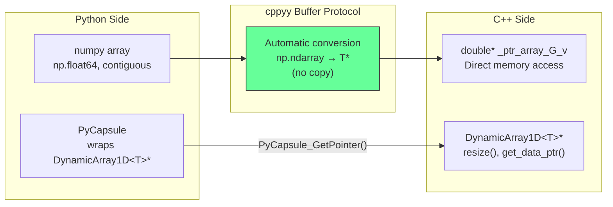

### Two Kinds of Array Access

**Static arrays** (fixed size, e.g., neuron state variables):
```
Python: np.ndarray → cppyy → double* (zero copy)
C++:    _ptr_array_G_v[_idx] = ...
```

**Dynamic arrays** (resizable, e.g., monitor recordings):
```
Python: PyCapsule → cppyy → DynamicArray1D<T>*
C++:    _dyn->resize(_newlen);
        _dyn->get_data_ptr()[i] = value;
```

PyCapsule names are standardized (`"DynamicArray1D"`, `"DynamicArray2D"`, `"CSpikeQueue"`) and extracted with templated helpers defined in the global support code.

---

## DynamicArray Backend

`brian2/memory/cppyy_dynamicarray.py` is a drop-in replacement for the Cython DynamicArray wrappers:

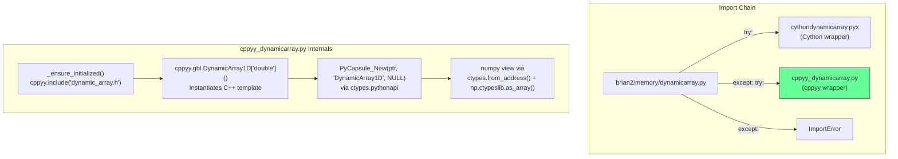

Key design choices:
- Uses `ctypes.pythonapi.PyCapsule_New` instead of cppyy for capsule creation (avoids template lookup issues)
- Uses C++ helpers returning `uintptr_t` for reliable address extraction (`cppyy.addressof()` fails on some pointer types)
- numpy views are zero-copy via `ctypes.from_address()`

---

## SpikeQueue Backend

`brian2/synapses/cppyy_spikequeue.py` wraps `CSpikeQueue` from `spikequeue.h`:

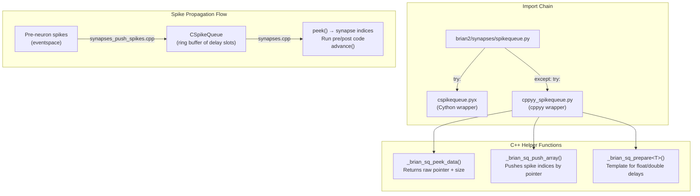

---

## Synapse Creation and Lifecycle

Synapse creation is the most complex part of the backend:

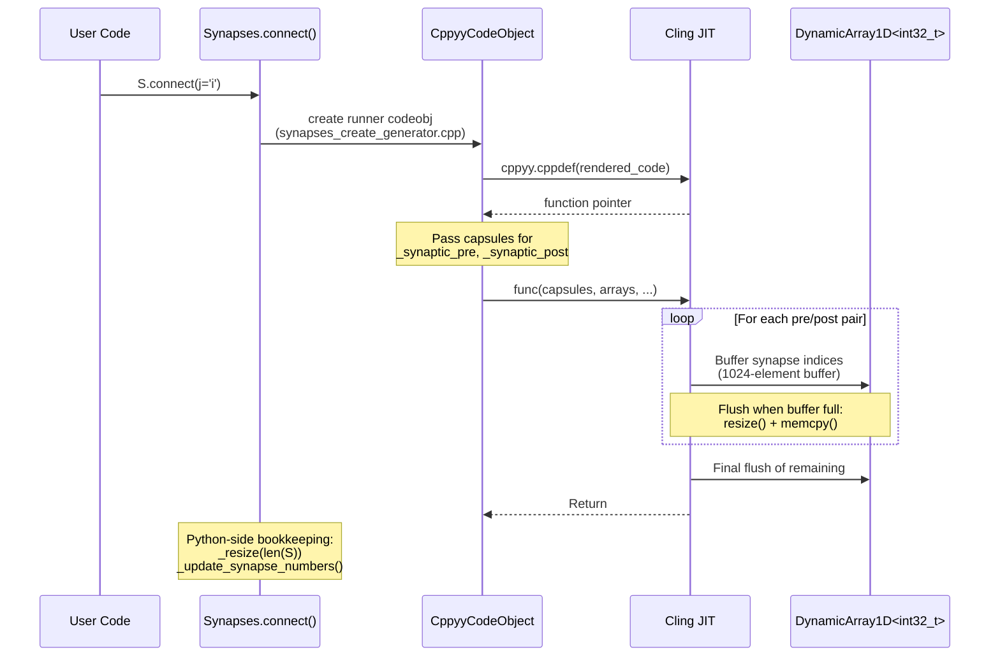

### Buffered Synapse Creation (Performance Optimization)

The generator template uses a 1024-element buffer to batch resize calls:

```
Without buffering: O(n) resize calls     (1 per synapse)
With buffering:    O(n/1024) resize calls (1 per 1024 synapses)
```

This matches the Cython backend's batching pattern.

---

## Monitor Data Flow

All three monitors follow the same capsule-based pattern:

```mermaid
flowchart TD
    subgraph "SpikeMonitor"
        SM_SPIKE["Detect spikes<br/>(from eventspace)"]
        --> SM_RESIZE["Resize via capsules:<br/>t, i, recorded vars"]
        --> SM_CACHE["Cache data pointers<br/>(extracted once)"]
        --> SM_WRITE["Write spike data<br/>using cached pointers"]
    end

    subgraph "StateMonitor"
        ST_TIME["Append current time<br/>(1D resize via capsule)"]
        --> ST_RESIZE["Resize 2D arrays<br/>(via capsule)"]
        --> ST_CACHE["Cache 2D array refs<br/>(extracted once)"]
        --> ST_WRITE["For each neuron:<br/>write via cached ref"]
    end

    subgraph "RateMonitor"
        RM_COUNT["Count spikes in<br/>source range"]
        --> RM_RESIZE["Resize t, rate<br/>(via capsules)"]
        --> RM_WRITE["Write time + rate"]
    end
```

The capsule pattern means the C++ code directly manipulates the same `DynamicArray` objects that Cython created — no Python overhead for resize/write.

---

## Guard-Protected Support Code

Cling (cppyy's compiler) can't redefine symbols. When Brian2 recreates code objects (e.g., calling `run()` multiple times), identical support code would cause redefinition errors:

```mermaid
flowchart TD
    CODE["Generated C++ code"]
    --> SPLIT["Split at 'extern \"C\"'"]

    SPLIT --> SUPPORT["Support code<br/>(inline functions, #defines)"]
    SPLIT --> FUNC["Function definition<br/>(unique name per codeobject)"]

    SUPPORT --> HASH["MD5 hash of<br/>non-comment lines"]
    HASH --> GUARD["#ifndef _BRIAN_CPPYY_SC_{hash}<br/>#define ...<br/>...support code...<br/>#endif"]

    GUARD --> MERGE["Merge back with<br/>function definition"]
    FUNC --> MERGE
    MERGE --> CPPDEF["cppyy.cppdef()"]
```

The `_guard_support_code()` function in `cppyy_rt.py` handles this automatically. The function definition (with its unique `_brian_cppyy_{block}_{name}` identifier) is left unguarded.

---

## Global Support Code

One-time initialization compiled via `_ensure_support_code()`:

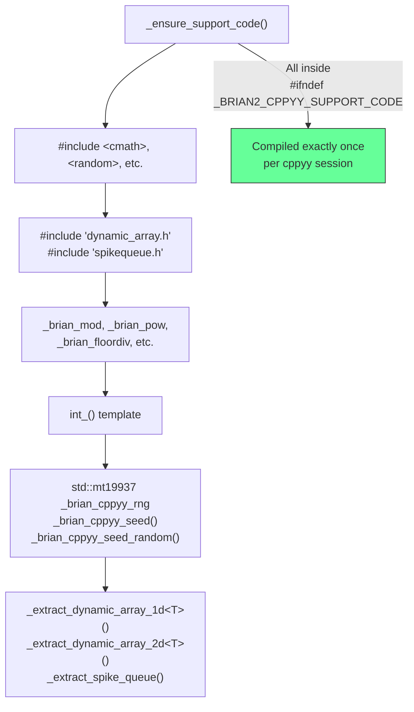

---

## Compilation and Execution Lifecycle

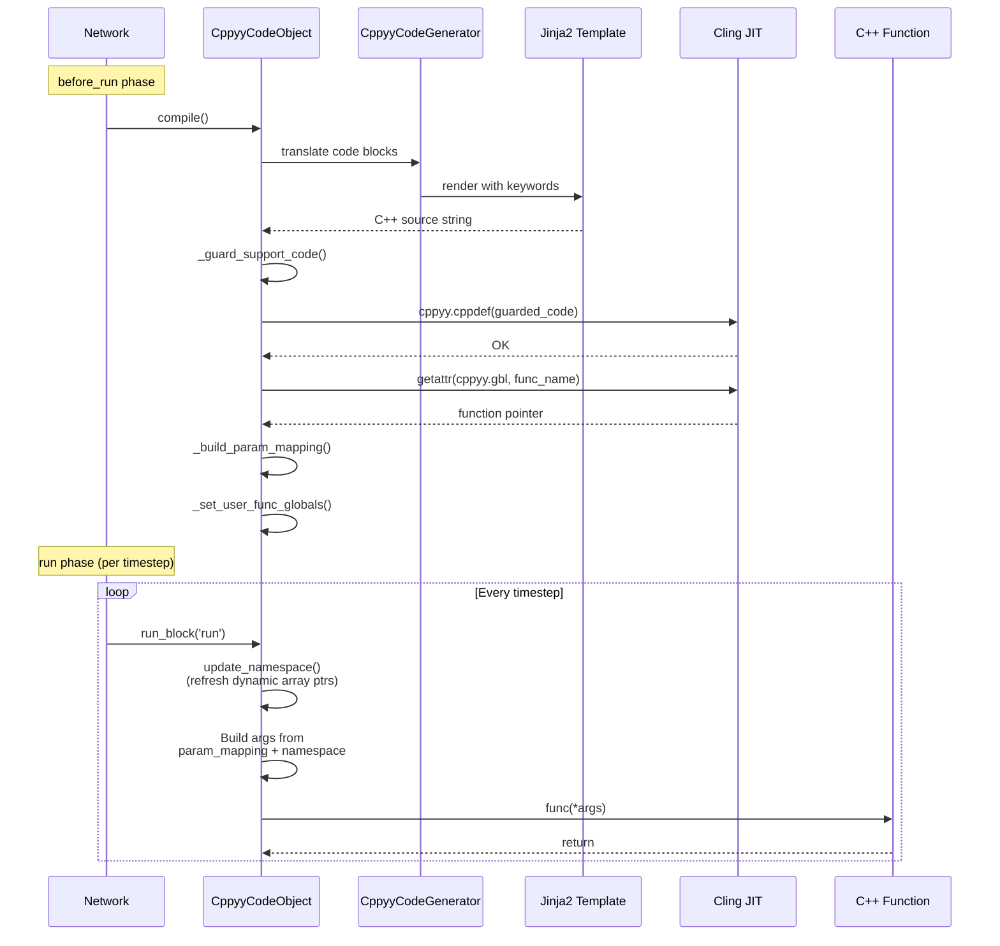

---

## Architecture: File Map

```
brian2/
├── codegen/
│   ├── _prefs.py                       # codegen.target preference ("auto"/"cppyy"/...)
│   ├── targets.py                      # codegen_targets registry (set of CodeObject classes)
│   ├── generators/
│   │   ├── cpp_generator.py            # Base C++ translation (expressions, statements)
│   │   └── cppyy_generator.py          # cppyy overrides: array naming, parameter assembly
│   └── runtime/
│       ├── __init__.py                 # Imports and registers all targets
│       └── cppyy_rt/
│           ├── __init__.py             # Registers CppyyCodeObject
│           ├── cppyy_rt.py             # CppyyCodeObject: compile, namespace, run
│           ├── introspector.py         # Optional runtime inspection tool
│           └── templates/
│               ├── common_group.cpp    # Base template: extern "C" function skeleton
│               ├── stateupdate.cpp     # ODE integration loop
│               ├── threshold.cpp       # Spike detection
│               ├── reset.cpp           # Post-spike reset
│               ├── ratemonitor.cpp     # Population rate recording
│               ├── spikemonitor.cpp    # Individual spike recording
│               ├── statemonitor.cpp    # Variable trace recording
│               ├── synapses.cpp        # Synapse propagation
│               ├── synapses_push_spikes.cpp
│               ├── synapses_create_array.cpp
│               ├── synapses_create_generator.cpp
│               ├── summed_variable.cpp
│               ├── group_variable_get.cpp
│               ├── group_variable_get_conditional.cpp
│               ├── group_variable_set.cpp
│               └── group_variable_set_conditional.cpp
├── devices/
│   └── device.py                       # auto_target(), seed() with cppyy RNG support
├── memory/
│   ├── dynamicarray.py                 # Fallback chain: Cython → cppyy
│   └── cppyy_dynamicarray.py           # cppyy DynamicArray wrapper
└── synapses/
    ├── spikequeue.py                   # Fallback chain: Cython → cppyy
    ├── cppyy_spikequeue.py             # cppyy SpikeQueue wrapper
    └── synapses.py                     # Python-side synapse bookkeeping for cppyy
```

---

## What Was Changed and Why

### Phase 1: Quick Wins

**ratemonitor.cpp** — Was completely broken. Used nonexistent `.push_back()` on DynamicArray. Rewritten to use capsule-based resize pattern matching spikemonitor/statemonitor.

**RNG seeding** — Added `_brian_cppyy_seed()` and `_brian_cppyy_seed_random()` C++ functions exposed via `extern "C"`. Called from `device.py:seed()` so `seed(42)` works for reproducible simulations.

**Parameter assertions** — Added diagnostic logging in `run_block()` to catch parameter count mismatches between Python and C++ sides.

### Phase 2: DynamicArray Backend

**`brian2/memory/cppyy_dynamicarray.py`** — Drop-in cppyy replacement for Cython's DynamicArray wrappers. Uses:
- `cppyy.gbl.DynamicArray1D["double"]()` to instantiate C++ templates
- `ctypes.pythonapi.PyCapsule_New` for capsule creation (ctypes, not cppyy — avoids template lookup issues)
- C++ helpers `_brian_dynarray_data_addr_1d/2d` returning `uintptr_t` for reliable address extraction
- Zero-copy numpy views via `ctypes.from_address()` + `np.ctypeslib.as_array()`

**`brian2/memory/dynamicarray.py`** — Changed from hard Cython import to fallback chain: Cython → cppyy.

### Phase 3: SpikeQueue

**`brian2/synapses/cppyy_spikequeue.py`** — cppyy wrapper for CSpikeQueue from `spikequeue.h`. Uses C++ helpers for data passing:
- `_brian_sq_peek_data()` — returns raw pointer + size for zero-copy peek
- `_brian_sq_push_array()` — pushes spike indices by pointer
- `_brian_sq_prepare<scalar>()` — template function for float/double delay preparation

**`brian2/synapses/spikequeue.py`** — Same Cython → cppyy fallback pattern.

### Phase 4: Synapse Templates

Four new templates in `brian2/codegen/runtime/cppyy_rt/templates/`:

- **synapses.cpp** — Main synapse propagation: extracts CSpikeQueue from `_queue_capsule`, peeks synapse indices, runs pre/post code per synapse, advances queue
- **synapses_push_spikes.cpp** — Reads spike count from eventspace, pushes to queue
- **synapses_create_array.cpp** — Direct i,j synapse creation via capsule-based resize
- **synapses_create_generator.cpp** — Complex template handling range, fixed-sample, and probabilistic iterators

**Key fix**: `_queue_capsule` (an `ObjectVariable`) wasn't being included in function parameters because the generator/code object only handled `ArrayVariable`, `Constant`, and `Function`. Added detection of `*_capsule`-named non-standard variables in both `determine_keywords()` and `_build_param_mapping()`.

**Key fix**: After cppyy creates synapses (resizing DynamicArrays in C++), Python-side `N` and synapse bookkeeping wasn't updated. Added explicit `_owner._resize()` / `_owner._update_synapse_numbers()` calls from Python after the code object runs.

### Phase 5: Performance Audit

**Buffered synapse creation** — `synapses_create_generator.cpp` now uses 1024-element buffers with `_flush_buffer()` helper (O(n/1024) resize calls, matching Cython).

**Cached capsule extraction** — `spikemonitor.cpp` and `statemonitor.cpp` extract capsules once before loops instead of per-iteration.

**Consolidated helpers** — `_extract_spike_queue()` moved from template support code to global support code (defined once, available everywhere).

**Standardized naming** — `ratemonitor.cpp` now uses `get_array_name()` instead of hardcoded `_dynamic_array_` prefix.

### Phase 6: Multi-Backend Support

Already clean — no additional changes needed:
- `auto_target()` handles priority selection
- Fallback chains in `dynamicarray.py` and `spikequeue.py`
- All three targets (numpy, cython, cppyy) coexist cleanly

---

## How to Experiment

### Basic Setup

```python
from brian2 import *
prefs.codegen.target = "cppyy"
```

### Running the Test Suite

```bash
cd /path/to/brian2
source venv/bin/activate

# Comprehensive audit test (16 tests, subprocess-isolated)
python test-cppyy-audit.py

# Basic HH neuron test
python test-cppyy.py

# Synapse tests (connectivity, STDP, summed variables)
python test-cppyy-synapses.py

# DynamicArray backend tests
python test-cppyy-dynarray.py
```

### Introspection

Enable to inspect generated C++ code at runtime:

```python
prefs.codegen.runtime.cppyy.enable_introspection = True

# After running a simulation:
from brian2.codegen.runtime.cppyy_rt.introspector import get_introspector
intro = get_introspector()
intro.summary()  # Shows all compiled code objects
intro.source("neurongroup_stateupdater")  # View generated C++ source
```

### Preferences

```python
# Extra compiler flags for Cling
prefs.codegen.runtime.cppyy.extra_compile_args = ['-O2', '-ffast-math']

# Enable introspection
prefs.codegen.runtime.cppyy.enable_introspection = True
```

---

## Limitations and Open Problems

### Missing Templates

Three Cython templates have no cppyy equivalent yet:
- **`spatialstateupdate`** — Spatial (multi-compartment) neurons. Uses specialized linear algebra that needs careful porting.
- **`spikegenerator`** — SpikeGeneratorGroup. Relatively straightforward to port.
- **`group_get_indices`** — Used by some group operations. Low priority.

### Known Issues

1. **First-run JIT overhead**: The first `cppyy.cppdef()` call takes ~2-3 seconds as Cling initializes. Subsequent calls are fast. This is still much faster than Cython's full compilation cycle.

2. **Cling memory**: Cling keeps all compiled code in memory. Very long sessions with many `run()` calls accumulate compiled code. Not a problem for typical use.

3. **Template instantiation**: cppyy's template lookup syntax (`cppyy.gbl.func["type"]`) can be finicky. We use C++ helper functions with explicit types to work around this.

4. **`addressof` limitations**: `cppyy.addressof()` fails on certain pointer types (e.g., `char*`). We work around this with C++ helper functions that return `uintptr_t`.

5. **No standalone device support**: The cppyy backend only works with `RuntimeDevice`, not `CPPStandaloneDevice`. The standalone device generates complete C++ projects — a fundamentally different approach.

6. **Cling state conflicts**: Multiple `start_scope()` calls within a single process can cause Cling redefinition errors. The guard code handles most cases, but edge cases exist. Test suites should use subprocess isolation.

7. **Time-based refractoriness**: `refractory=5*ms` may not enforce exact timing with some integration methods. String-based conditions (`refractory='v > -40*mV'`) work correctly.

---

## Continuation Prompt

Use this to resume work in a new conversation:

> I'm working on the brian2 `experimental-cppyy` branch — a cppyy/Cling JIT codegen backend that replaces Cython AOT compilation. The backend is functional with: state updates, thresholds, resets, monitors (spike/state/rate), synapses (creation, propagation, STDP), DynamicArray/SpikeQueue fallbacks, RNG seeding, and an introspector.
>
> Key files: `brian2/codegen/runtime/cppyy_rt/cppyy_rt.py` (code object), `brian2/codegen/generators/cppyy_generator.py` (code generator), templates in `brian2/codegen/runtime/cppyy_rt/templates/`, `brian2/memory/cppyy_dynamicarray.py`, `brian2/synapses/cppyy_spikequeue.py`.
>
> Read `docs/cppyy-backend.md` for the full architecture doc. The three naming worlds (device → generator → C++ body) and parameter sync between `determine_keywords()` and `_build_param_mapping()` are the most critical invariants.
>
> Next steps: port missing templates (spatialstateupdate, spikegenerator, group_get_indices), and run the full Brian2 test suite with `prefs.codegen.target = "cppyy"`.
