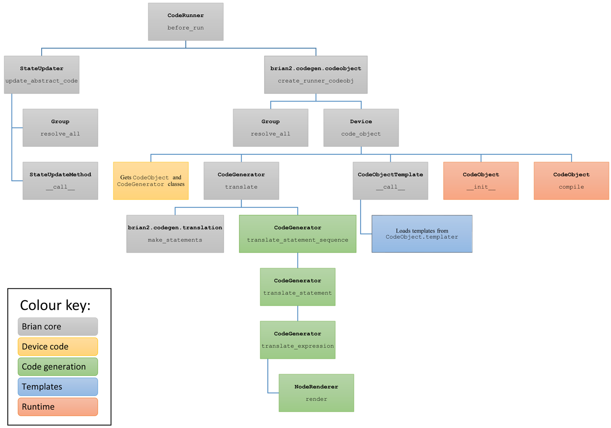

Code generation
===============

The generation of a code snippet is done by a `CodeGenerator` class.
The templates are stored in the `CodeObject.templater` attribute, which is
typically implemented as a subdirectory of templates. The compilation and
running of code is done by a `CodeObject`. See the sections below for each
of these.

Code path
---------

The following gives an outline of the key steps that happen for the code
generation associated to a `NeuronGroup` `StateUpdater`. The items in grey
are Brian core functions and methods and do not need to be implemented to
create a new code generation target or device. The parts in yellow are
used when creating a new device. The parts in green relate to generating
code snippets from abstract code blocks. The parts in blue relate to creating
new templates which these snippets are inserted into. The parts in red
relate to creating new runtime behaviour (compiling and running generated
code).

In brief, what happens can be summarised as follows. `Network.run` will call
`BrianObject.before_run` on each of the objects in the network. Objects such
as `StateUpdater`, which is a subclass of `CodeRunner` use this spot to
generate and compile their code. The process for doing this is to first
create the abstract code block, done in the `StateUpdater.update_abstract_code`
method. Then, a `CodeObject` is created with this code block. In doing so,
Brian will call out to the currently active `Device` to get the `CodeObject`
and `CodeGenerator` classes associated to the device, and this hierarchy of
calls gives several hooks which can be changed to implement new targets.

Code generation
---------------

To implement a new language, or variant of an existing language, derive a class
from `CodeGenerator`. Good examples to look at are the `NumpyCodeGenerator`,
`CPPCodeGenerator` and `CythonCodeGenerator` classes in the
``brian2.codegen.generators`` package. Each `CodeGenerator` has a ``class_name``
attribute which is a string used by the user to refer to this code generator
(for example, when defining function implementations).

The derived `CodeGenerator` class should implement the methods marked as
``NotImplemented`` in the base `CodeGenerator` class. `CodeGenerator` also has
several handy utility methods to make it easier to write these, see the
existing examples to get an idea of how these work.

Syntax translation
------------------

One aspect of writing a new language is that sometimes you need to translate
from Python syntax into the syntax of another language. You are free to
do this however you like, but we recommend using a `NodeRenderer` class
which allows you to iterate over the abstract syntax tree of an expression.
See examples in ``brian2.parsing.rendering``.

Templates
---------

In addition to snippet generation, you need to create templates for the
new language. See the ``templates`` directories in ``brian2.codegen.runtime.*``
for examples of these. They are written in the Jinja2 templating system. The
location of these templates is set as the `CodeObject.templater` attribute.
Examples such as `CPPCodeObject` show how this is done.

Template structure
~~~~~~~~~~~~~~~~~~

Languages typically define a ``common_group`` template that is the base for all
other templates. This template sets up the basic code structure that will be reused by
all code objects, e.g. by defining a function header and body, and adding standard
imports/includes. This template defines several blocks, in particular a ``maincode``
clock containing the actual code that is specific to each code object. The specific
templates such as ``reset`` then derive from the ``common_group`` base template and
override the ``maincode`` block. The base template can also define additional blocks
that are sometimes but not always overwritten. For example, the ``common_group.cpp``
template of the C++ standalone code generator defines an ``extra_headers`` block that
can be overwritten by child templates to include additional header files needed for the
code in ``maincode``.

Template keywords
~~~~~~~~~~~~~~~~~

Templates also specify additional information necessary for the code generation process
as Jinja comments (``{# ... #}``). The following keywords are recognized by Brian:

``USES_VARIABLES``
    Lists variable names that are used by the template, even if they are not referred to
    in user code.
``WRITES_TO_READ_ONLY_VARIABLES``
    Lists read-only variables that are modified by the template. Normally, read-only
    variables are not considered to change during code execution, but e.g. synapse
    creation requires changes to synaptic indices that are considered read-only
    otherwise.
``ALLOWS_SCALAR_WRITE``
    The presence of this keyword means that in this template, writing to scalar
    variables is permitted. Writing to scalar variables is not permitted by default,
    because it can be ambiguous in contexts that do not involve all neurons/synapses.
    For example, should the statement ``scalar_variable += 1`` in a reset statement
    update the variable once or once for every spiking neuron?
``ITERATE_ALL``
    Lists indices that are iterated over completely. For example, during the state
    update or threshold step, the template iterates over all neurons with the standard
    index ``_idx``. When executing the reset statements on the other hand, not all
    neurons are concerned. This is only used for the numpy code generation target,
    where it allows avoiding expensive unnecessary indexing.

Code objects
------------

To allow the final code block to be compiled and run, derive a class from
`CodeObject`. This class should implement the placeholder methods defined in
the base class. The class should also have attributes ``templater`` (which
should be a `Templater` object pointing to the directory where the templates
are stored)
``generator_class`` (which should be the `CodeGenerator` class), and
``class_name`` (which should be a string the user can use to refer to this
code generation target.

Default functions
-----------------

You will typically want to implement the default functions such as the
trigonometric, exponential and ``rand`` functions. We usually put these
implementations either in the same module as the `CodeGenerator` class or
the `CodeObject` class depending on whether they are language-specific or
runtime target specific. See those modules for examples of implementing
these functions.

Code guide
----------

* ``brian2.codegen``: everything related to code generation
* ``brian2.codegen.generators``: snippet generation,
  including the `CodeGenerator` classes and default function implementations.
* ``brian2.codegen.runtime``: templates, compilation and running of code,
  including `CodeObject` and default function implementations.
* ``brian2.core.functions``, ``brian2.core.variables``: these define the values
  that variable names can have.
* ``brian2.parsing``: tools for parsing expressions, etc.
* ``brian2.parsing.rendering``: AST tools for rendering expressions in Python
  into different languages.
* ``brian2.utils``: various tools for string manipulation, file management, etc.

Additional information
----------------------

For some additional (older, but still accurate) notes on code generation:

.. toctree::
   :maxdepth: 2

   oldcodegen
