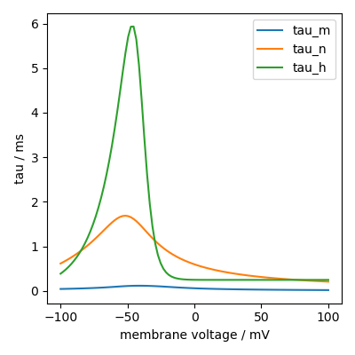

How to plot functions
=====================

Models of synapses and neurons are typically composed of a series of functions.
To affirm their correct implementation a plot is often helpful.

Consider the following membrane voltage dependent Hodgkin-Huxley equations::

	from brian2 import *

	VT = -63*mV

	eq = Equations("""
	alpha_m = 0.32*(mV**-1)*4*mV/exprel((13*mV-v+VT)/(4*mV))/ms : Hz
	beta_m = 0.28*(mV**-1)*5*mV/exprel((v-VT-40*mV)/(5*mV))/ms : Hz
	alpha_h = 0.128*exp((17*mV-v+VT)/(18*mV))/ms : Hz
	beta_h = 4./(1+exp((40*mV-v+VT)/(5*mV)))/ms : Hz
	alpha_n = 0.032*(mV**-1)*5*mV/exprel((15*mV-v+VT)/(5*mV))/ms : Hz
	beta_n = .5*exp((10*mV-v+VT)/(40*mV))/ms : Hz
	tau_n = 1/(alpha_n + beta_n) : second
	tau_m = 1/(alpha_m + beta_m) : second
	tau_h = 1/(alpha_h + beta_h) : second
	""")

We can do the following to plot them as function of membrane voltage::

	group = NeuronGroup(100, eq + Equations("v : volt"))
	group.v = np.linspace(-100, 100, len(group))*mV

	plt.plot(group.v/mV, group.tau_m[:]/ms, label="tau_m")
	plt.plot(group.v/mV, group.tau_n[:]/ms, label="tau_n")
	plt.plot(group.v/mV, group.tau_h[:]/ms, label="tau_h")
	plt.xlabel('membrane voltage / mV')
	plt.ylabel('tau / ms')
	plt.legend()

Note that we need to use ``[:]`` for the ``tau_...`` equations, because Brian cannot
resolve the external constant ``VT`` otherwise. Alternatively we could have supplied
the constant in the namespace of the `NeuronGroup`, see :doc:`/advanced/namespaces`.
